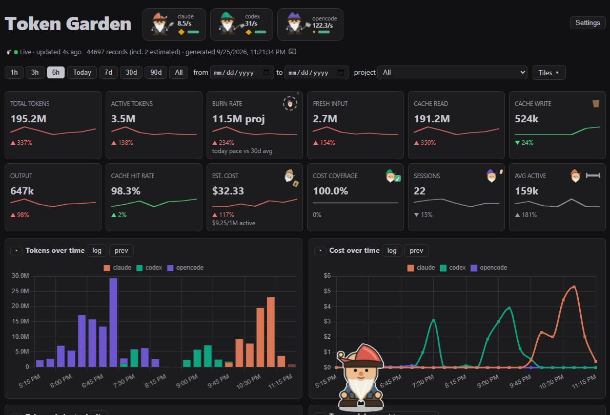

# Token Garden

A privacy-first local dashboard that shows token usage and estimated cost across **Claude Code**, **Codex**, and **OpenCode** sessions on this machine.



Token Garden reads local agent session logs and serves the dashboard only on `127.0.0.1`. It is designed for local use, not deployment to a public server.

## AI-extensible by design

Token Garden is intentionally small, local, and inspectable. A coding agent can clone it, review its code and security boundaries, verify operating-system assumptions, adapt local log locations, add a harness or character crew, and test the result. The user stays in control: extensions are ordinary source changes with visible diffs, not remotely loaded code or a hidden plugin runtime.

## Use it with AI

Give this prompt to your coding agent:

> Clone `https://github.com/arturochang/token-garden`, read `README.md` and `AGENTS.md`, verify Node.js 22+, then start Token Garden with `npm run usage:serve` and tell me the local URL. Keep it bound to loopback and never commit generated usage data. When I ask for a custom character crew, follow `docs/crew-architecture.md`, create it in `crews/private/`, review it as executable code, and test every visual state.

No dependency installation or build step is required.

## Choose harnesses

Use the harness checkboxes in **Settings** to monitor one or several supported harnesses. The selection persists locally. To skip unused collectors entirely, set a comma-separated allowlist before starting:

```powershell
$env:TOKEN_GARDEN_SOURCES = "codex,opencode"
npm run usage:serve
```

```sh
TOKEN_GARDEN_SOURCES=codex,opencode npm run usage:serve
```

Want to add Cursor, CommandCode, or another local harness? See the concise [harness adapter guide](docs/harness-architecture.md), including a copy-paste AI prompt.

## Run it

Requires Node.js 22 or newer.

```sh
git clone https://github.com/arturochang/token-garden.git
cd token-garden
```

**Live (recommended):**

```sh
npm run usage:serve
```

Then open http://127.0.0.1:4317. The server collects usage every 10 s, and the page polls it every 10 s, so new usage appears within about 15 s. Filters, time range, toggles, collapsed sections and sort order persist to localStorage instantly and mirror to the server (`.usage-prefs.json`). They survive restarts, port changes and other browsers, and the newest write wins. Scroll position stays the same across refreshes. The header shows `Live · updated Ns ago`, with a red dot when the server is unreachable. The server only listens on 127.0.0.1.

**Static snapshot:**

```sh
npm run usage
```

Then open `index.html` straight from disk. This writes `data.js`, a one-time snapshot, and the page doesn't refresh. Rerun the command to update it.

Both modes load a pinned Chart.js 4.5.1 build from jsDelivr with subresource-integrity verification, so the page needs an internet connection.

### Configuration

| Variable | Default | Effect |
|---|---|---|
| `PORT` | `4317` | Port for `serve.mjs` (always bound to `127.0.0.1`). |
| `TOKEN_GARDEN_SOURCES` | all | Comma-separated collectors to run: `claude,codex,opencode`. |
| `TOKEN_GARDEN_OFFLINE` | unset | `1` skips the LiteLLM price download; built-in or cached prices are used. |
| `USAGE_CACHE` | `.usage-cache.json` | Location of the per-file parse cache. |
| `USAGE_PREFS` | `.usage-prefs.json` | Location of the UI preference mirror. |
| `COLLECT_PROFILE` | unset | `1` prints per-source collection timings to stderr. |

## Privacy and security

Token Garden reads your agent logs **read-only** and never uploads them.

- **What stays local:** session titles (the first user message), project and workspace names (derived from local paths), and every token count. The server binds only to `127.0.0.1`.
- **Network requests:** the browser fetches Chart.js from jsDelivr (SRI-pinned). The server downloads the public LiteLLM price table from GitHub once an hour. That request sends no local data, and `TOKEN_GARDEN_OFFLINE=1` disables it.
- **Browser boundary:** requests with a non-local `Host` header (DNS rebinding) or a foreign `Origin` (CSRF) are rejected. Preference writes require `application/json` and are filtered through an allowlist. The page is served with a Content Security Policy whose `connect-src 'self'` stops page scripts, including installed crews, from sending data to other hosts. Log-derived text is escaped before rendering.
- **Generated files** that may contain local metadata (`data.js`, snapshots, caches, and preferences) are excluded by `.gitignore`. To share an export, use the anonymized snapshot command under [Scripting](#scripting), not `data.js`.

See [SECURITY.md](SECURITY.md) to report a vulnerability.

## Custom crews

The public repository ships only the original garden gnomes. In live mode, Token Garden discovers crew scripts in both `crews/` and the gitignored `crews/private/`; installed private crews then appear in Settings. Crew scripts are executable JavaScript, so review them before placing them there. The [crew architecture guide](docs/crew-architecture.md#creating-a-crew-with-ai) contains the extension contract and a focused prompt for detailed local characters.

## Acknowledgments

Token Garden's accounting and dashboard design were informed by [tokscale](https://github.com/junhoyeo/tokscale) and [codex-token-dashboard](https://github.com/xiaoqi8553/codex-token-dashboard). Their projects remain independently licensed.

## What it shows

- **Time range:** 1h, 3h, 6h, Today, 7d, 30d, 90d, All, or custom dates. Chart bars are 5 min wide for 1h, 15 min for up to 6h, hourly for up to 2 days, daily for up to 120 days, and weekly beyond that. Tokens/Cost charts overlay a dashed gray previous-period line for direct shape comparison (separate `prev` pills per chart), plus a `log` toggle (log scale keeps huge prev spikes from flattening the current period; stacking pauses in log mode). The control bar sticks while scrolling.
- **Sections:** every chart box collapses via the ▾ toggle in its title; hidden sections persist across reloads.
- **Filters:** tool, project (last folder of the session cwd), group-by (model / project / workspace / tool+model / workspace+model), and whether to include subagent sessions.
- **KPI tiles:** total tokens, active tokens, burn rate (today pace vs 30d avg), fresh input, cache read, cache write, output, cache hit rate, estimated cost (with $/1M-active unit cost), cost coverage, number of sessions, and average active tokens per session. Numbers grow a billions tier past 1B. Header notes `incl. N estimated` when text-length fallbacks are present (marked `~` in the table). Every tile carries a 7-slice sparkline and a delta vs the comparison window, with per-tile polarity (hit-rate up = green, token/cost up = red, sessions/averages neutral). 7d+ ranges compare against the previous period; 1h/3h/6h/Today compare against the same clock window yesterday.
- **Charts:** tokens over time (stacked by tool, zero-filled gaps, idle tool series hidden, in-progress bar dimmed, dashed previous-period overlay), cost over time (monotone-smooth, prev overlay), token mix per tool (empty tools hidden), top groups (follows group-by), top cost by model, month-to-date cumulative spend (hourglass shows month elapsed), cache hit rate trend (hourly intraday, daily beyond), most-expensive-sessions top 10, and a weekday × hour activity heatmap over the trailing 28d (metric switch: tokens/active/cost) with a rhythm panel (peak hour/weekday, night/weekend share, streak, window cost).
- **Sessions table:** sortable, with workspace (auto-hidden when identical to project), active, and `~` estimated flag. Claude/Codex titles come from the first user message; OpenCode titles come from OpenCode's own session title.
- **Theme:** auto (follows OS) / dark / light setting, persisted. Charts re-tint on switch.
- **Gnome crew:** three garden gnomes in the header (one per tool, hat in tool color) bounce and swing tools at a speed following active tokens/sec in the current window (log scale), each labeled with its live rate. Idle tools visibly sleep (tilt + Zzz); filtered-out tools ghost. Click a gnome (or Enter/Space) to toggle its tool filter. Gold sack scales with window cost, green cart bar shows cache hit rate, dust puffs fly past 1500/s. The crew visibility setting removes every gnome on screen. Honors `prefers-reduced-motion`.
- **Tile mascots:** burn-rate hamster wheel (RPM follows pace, pants past 2x baseline), cost-coverage stamping accountant (magnifier when tokens await pricing), avg weightlifter (barbell scales log), sessions receptionist (pops a guest when count ticks up live), est-cost merchant (price-tag insight, faints at 100x+ model gaps), cache-write bucket (empty vs sloshing full).
- **Crew support staff:** live-dot lookout (scopes when live, snoozes on static snapshots), meta-line courier (parcel on fresh data, slate on 304s), custom-range clerk, subagent baby (ghosts when excluded), MTD hourglass (sand = month elapsed), arm-wrestle pairs on ×5+ deltas, shruggers on empty states. All animations pause when the tab hides.
- **Settings:** theme, language, crew visibility/style, harness filters, and subagent visibility live in one modal opened from the header.

## Data sources

| Tool | Where it reads | Notes |
|---|---|---|
| Claude Code | `~/.claude/projects/**/*.jsonl` | `message.usage` on assistant lines. Deduped on `message.id:requestId`, because the same response is written several times. Sidechain (subagent) lines are flagged. Title = first user message. |
| Codex | `~/.codex/sessions/YYYY/MM/DD/rollout-*.jsonl` | `token_usage_record` payloads count as per-request increments; `token_count` events prefer `last_token_usage` with cumulative `total_token_usage` diff fallback. Dedupe on response/request id + turn, with reset handling. `cached_input_tokens` is subtracted from input. Files with no usage fields yield one `estimated` record from text length (CJK-aware). Title = first user message. |
| OpenCode | `~/.local/share/opencode/opencode.db` (SQLite, opened read-only) | Reads both the v1 `message`/`session` tables and the v2 `session_message`/`session_v2` tables (the v2 tables are what `opencode2` writes). |

## How tokens and cost are counted

- **Total** = fresh input + cache read + cache write + output. OpenCode reasoning is added on top because OpenCode reports it separately. Codex reasoning is already part of its output, and Claude doesn't report it.
- **Active** = fresh input + output (+ reasoning for OpenCode). Ignores cache reads; closer to "new work done".
- Most of the volume is cache reads, which are much cheaper. Check the fresh input tile and the token-mix chart before reading much into the total.
- **Cost:** OpenCode costs are the ones OpenCode stores itself. Claude and Codex costs are **estimates**. `prices.mjs` layers a LiteLLM snapshot (`prices-cache.json`) over the hardcoded fallback and matches on model-name prefix. The server refreshes the snapshot hourly and keeps using the last one while offline; run `node collect.mjs --refresh-prices` to force a refresh. Costs are computed when a log file is parsed, so a price change applies to files parsed after it. Models with no matching price show `—`.
- **Workspace:** git worktrees roll into the parent repo (`.git` file `gitdir:` pointer resolution, string-identity only — renames/nested repos resolve to their own root).

## Scripting

```sh
node collect.mjs --json --group-by=workspace+model  # aggregates to stdout
node collect.mjs --json --group-by=tool --out=groups.json  # UTF-8 file (preferred on Windows: `>` writes UTF-16)
node collect.mjs --snapshot=snapshot.json           # anonymized share: hashed sessions, no titles, projects as project-N
```

## Development

```sh
npm test   # node:test suites with synthetic fixtures; no network, no real logs
```

Contributions follow [AGENTS.md](AGENTS.md), which covers the extension points, privacy rules, and validation steps for both people and coding agents.

## Files

| File | Purpose |
|---|---|
| `collect.mjs` | Collectors. The CLI writes `data.js`. Also exports `createCollector()`, which caches each JSONL file by mtime and size so refreshes only re-parse changed files. |
| `serve.mjs` | Local HTTP server. `/` serves the page. `/api/usage` returns JSON, gzip-compressed and serialized once per change, with a content-hash ETag so unchanged polls get 304. `/api/prefs` stores UI prefs (allowlisted keys, server-stamped, last write wins). |
| `prices.mjs` | USD per 1M tokens, looked up by model-name prefix. |
| `index.html` | The dashboard: a single file with plain JS and Chart.js. |
| `crews/` | Crew registry and the built-in gnome crew. `crews/private/` (gitignored) holds local crews. |
| `i18n/` | UI strings (English, Traditional Chinese). |
| `docs/` | [Harness adapter](docs/harness-architecture.md) and [crew](docs/crew-architecture.md) guides. |
| `test/` | `node:test` suites using synthetic fixtures. |
| `data.js`, `snapshot.json` | Generated exports (gitignored). |
| `prices-cache.json` | LiteLLM snapshot cache (gitignored). |
| `.usage-cache.json` | Per-file parse cache (gitignored). |
| `.usage-prefs.json` | UI prefs mirror (gitignored). |

## Known limits

- A cold start parses every session log, which can take a minute or more for large histories. Results persist to `.usage-cache.json`, keyed by file mtime and size, so warm starts take about a second and only changed files are re-parsed. A corrupt cache or one from an older parser version is ignored; delete the file to force a full reparse.
- OpenCode's database is re-queried in full on each refresh; very large OpenCode histories make refreshes slower.
- The browser holds the whole payload in memory once, with repeated strings interned. Unchanged polls return 304 and trigger no re-parse.
- Session titles for Claude/Codex are the first user message (truncated); low-value system prompts are skipped.

## License

[MIT](LICENSE) © LAB256 LLC. Use it, fork it, remix it, and give your own agents a garden.

Made by [LAB256](https://lab256.com) · [Project page](https://lab256.com/blog/token-garden/)
